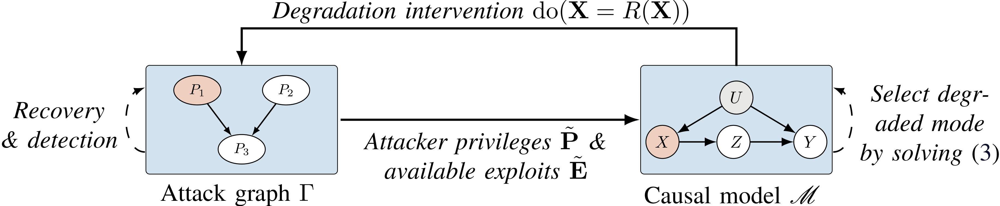
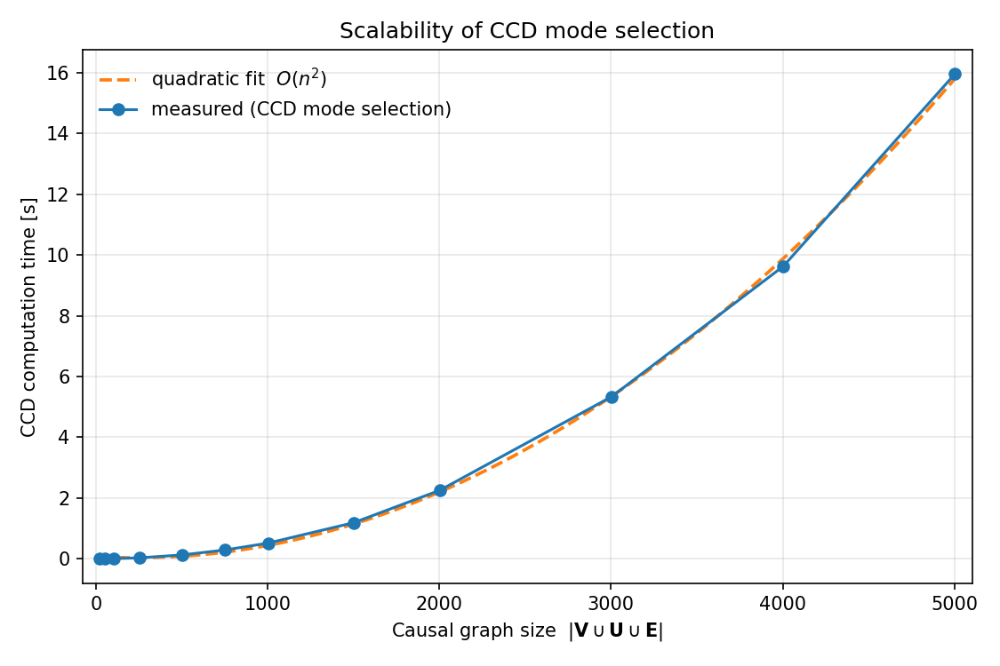
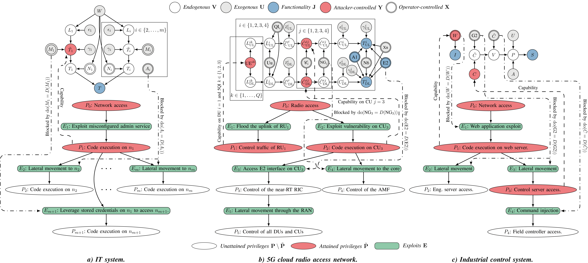

<p align="center">
    <a href="https://img.shields.io/badge/license-CC%20BY--SA%204.0-green">
        </a>
    <a href="https://img.shields.io/badge/version-0.1.0-blue">
        </a>
    <a href="https://img.shields.io/badge/python-3.10%2B-blue">
        </a>
    <a href="https://img.shields.io/badge/Maintained%3F-yes-green.svg">
        </a>
</p>

# Cyber Resilience through Controlled Degradation

A reference implementation of the **Causal Controlled Degradation (CCD)** method.



## Installation

Requires Python ≥ 3.10 and [DoWhy](https://github.com/py-why/dowhy), networkx, numpy,
pandas, scipy.

The distribution is published on PyPI as **`causal-controlled-degradation`**; the import
package is `ccd`:

```bash
pip install causal-controlled-degradation   # then: import ccd
```

Or install from a checkout for development:

```bash
pip install -e .
```

## Usage

Three scenarios of the illustrative example illustrate the recovery progression
`D_1 → D_2 → D_3` (default `m = 10` servers; pass `m` as an argument):

```bash
python examples/run_scenario_1.py       # attack just detected -> containment mode D_1
python examples/run_scenario_2.py       # E_2..E_{m+1} patched -> less restrictive mode D_2
python examples/run_scenario_3.py       # attacker evicted    -> full restore D_3
python examples/run_scenario_1.py 50    # run with m = 50 servers
```

## Scalability

`scalability.py` measures the wall-clock time of CCD's mode selection (Algorithm 1's
graph computation) as the causal graph grows. Larger graphs come from increasing the
number of servers `m` (the graph has `|V ∪ U ∪ E| = 10·m + 3` nodes):

```bash
python examples/scalability.py            # sweep up to m = 500
python examples/scalability.py 200        # cap the sweep at m = 200
```



### Causal-inference cost

`inference_scalability.py` measures the *other* cost — the causal-inference step
(`estimate_phi`: DoWhy GCM fit + interventional sampling) — as a function of the dataset
size `|D|`, with one curve per causal-graph size (four values of `m`):

```bash
python examples/inference_scalability.py    
```

## Sensitivity to misspecification

`sensitivity.py` studies how robust CCD is when its inputs are wrong. It builds the true
system, runs CCD on a **misspecified** copy, and evaluates the selected mode against the
true model, for four kinds of error:

- **Under-/overspecified causal graph** — missing / spurious edges;
- **Under-/overspecified attacker privileges** — a `P̃` that misses truly-held privileges
  or adds ones the attacker does not hold.

```bash
python examples/sensitivity.py    # writes sensitivity_structural.png, sensitivity_inference.png, _tables.tex
```

## Formal proofs (Lean 4)

The paper's theoretical results are formalized in **Lean 4 + Mathlib**, in a separate
Lake project under [`lean/`](lean/). See [`lean/README.md`](lean/README.md) for details.

```bash
brew install elan-init        # Lean toolchain manager (once)
cd lean
lake exe cache get            # prebuilt Mathlib cache
lake build                    # build the CCD library
```

## Development

```bash
./unit_tests.sh     # run the test suite (pytest)
./linter.sh         # flake8 (max line length 120; config in .flake8)
./type_checker.sh   # mypy
```

## Release Management

`make_release.py` bumps the version, builds the source and wheel distributions, and
uploads them to PyPI. Set the target version in the `NEW_VERSION` constant at the top of
the script. PyPI credentials credentials are taken from `~/.pypirc`.

```bash
pip install -e '.[release]'   # install build + twine
# edit NEW_VERSION in make_release.py, then:
python make_release.py      
```

## System  models



## License

Released under the **Creative Commons Attribution-ShareAlike 4.0 International**
(CC BY-SA 4.0) license; see [LICENSE.md](LICENSE.md).

© Kim Hammar, Emil C. Lupu, Tansu Alpcan, 2026
