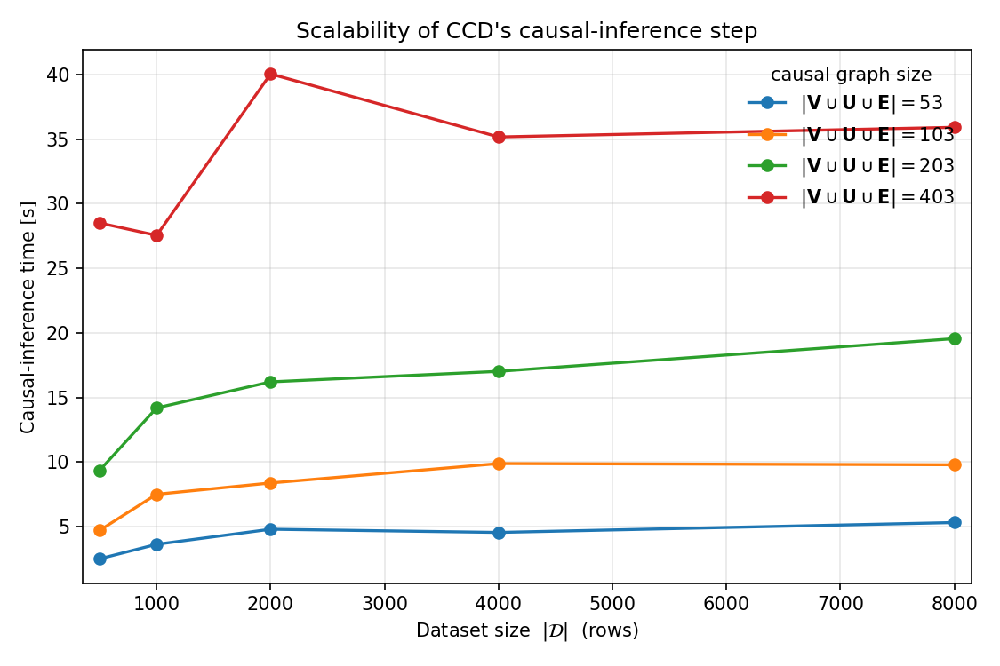

<p align="center">
    <a href="https://img.shields.io/badge/license-CC%20BY--SA%204.0-green">
        </a>
    <a href="https://img.shields.io/badge/version-0.1.0-blue">
        </a>
    <a href="https://img.shields.io/badge/python-3.10%2B-blue">
        </a>
    <a href="https://img.shields.io/badge/Maintained%3F-yes-green.svg">
        </a>
</p>

# Cyber Resilience through Controlled Degradation (CCD)

A reference implementation of the **Causal Controlled Degradation (CCD)** method.

## Installation

Requires Python ≥ 3.10 and [DoWhy](https://github.com/py-why/dowhy), networkx, numpy,
pandas, scipy.

```bash
pip install -e .
```

## Usage

Three scenarios of the illustrative example illustrate the recovery progression
`D_1 → D_2 → D_3` (default `m = 10` servers; pass `m` as an argument):

```bash
python run_scenario_1.py       # attack just detected -> containment mode D_1
python run_scenario_2.py       # E_2..E_{m+1} patched -> less restrictive mode D_2
python run_scenario_3.py       # attacker evicted    -> full restore D_3
python run_scenario_1.py 50    # run with m = 50 servers
```

- **Scenario 1 (D_1):** the attacker holds code-exec on `n_1` and the exploits
  `E_2..E_{m+1}` are still available. CCD isolates `n_1` — `do(N_1=0, M_1=0, A_2..A_m=0)` —
  containing lateral movement and DB access while preserving `~(m-1)/m` of throughput.
- **Scenario 2 (D_2):** operators have patched `E_2..E_{m+1}`. The attacker can no longer
  escalate, so CCD selects the strictly less restrictive `do(N_1=0)` — the management
  network and DB link are restored, `n_1` stays isolated from the gateway.
- **Scenario 3 (D_3):** the attacker has been evicted from `n_1` (`Y = ∅`). Nothing can
  affect throughput or privileges, so CCD selects the empty intervention `do()` — no links
  closed, full functionality restored.

The recovery modes are monotone: `D_1 ⊃ D_2 ⊃ D_3 = ∅`.

## Scalability

`scalability.py` measures the wall-clock time of CCD's mode selection (Algorithm 1's
graph computation) as the causal graph grows. Larger graphs come from increasing the
number of servers `m` (the graph has `|V ∪ U ∪ E| = 10·m + 3` nodes):

```bash
python scalability.py            # sweep up to m = 500
python scalability.py 200        # cap the sweep at m = 200
```

Writes `scalability.png` and `scalability_tables.tex`. The latter contains two
`\pgfplotstableread` tables for direct inclusion in a LaTeX/pgfplots document — `\ccdtime`
(measured time) and `\ccdquadraticfit` (the quadratic fit) — with x = causal graph size
`|V ∪ U ∪ E|` and y = time in seconds.

The measured curve matches the paper's bound `O(|X|(|V|+|U|+|E|))` — quadratic in the
graph size. (The DoWhy inference step is a separate, dataset-dependent cost and is not
included in this graph-algorithm measurement.)


### Causal-inference cost

`inference_scalability.py` measures the *other* cost — the causal-inference step
(`estimate_phi`: DoWhy GCM fit + interventional sampling) — as a function of the dataset
size `|D|`, with one curve per causal-graph size (four values of `m`):

```bash
python inference_scalability.py     # writes inference_scalability.png + _tables.tex
```

The `.tex` file holds one `\pgfplotstableread` table per curve (`\ccdinfsmall`,
`\ccdinfmedium`, `\ccdinflarge`, `\ccdinfxlarge` for `|V∪U∪E| = 53, 103, 203, 403`), with
x = dataset size `|D|` and y = time in seconds.



## Development

```bash
./unit_tests.sh     # run the test suite (pytest)
./linter.sh         # flake8 (max line length 120; config in .flake8)
./type_checker.sh   # mypy
```

## License

Released under the **Creative Commons Attribution-ShareAlike 4.0 International**
(CC BY-SA 4.0) license; see [LICENSE.md](LICENSE.md).

© Kim Hammar, Emil C. Lupu, Tansu Alpcan, 2026
