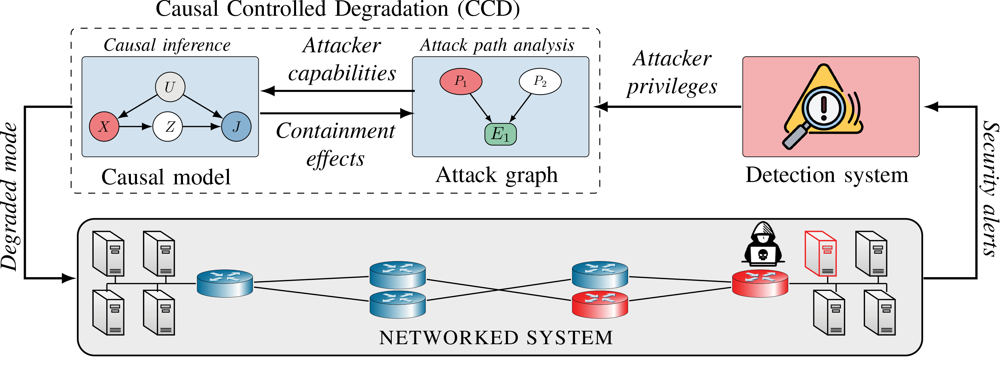
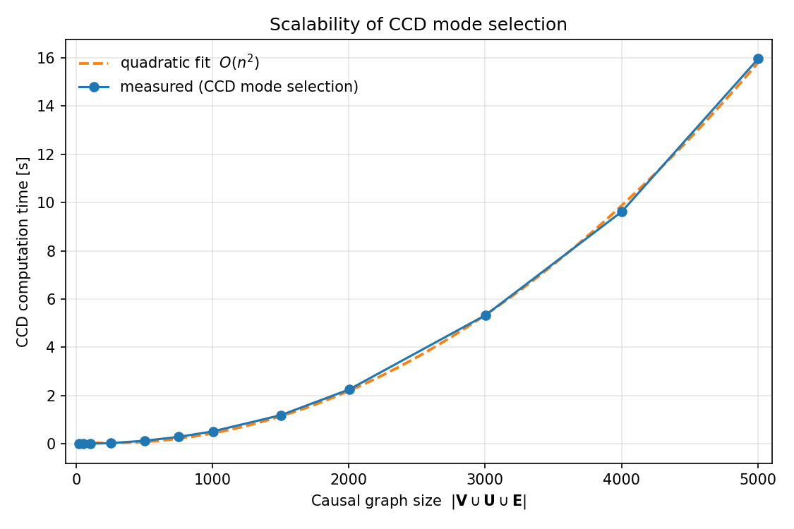
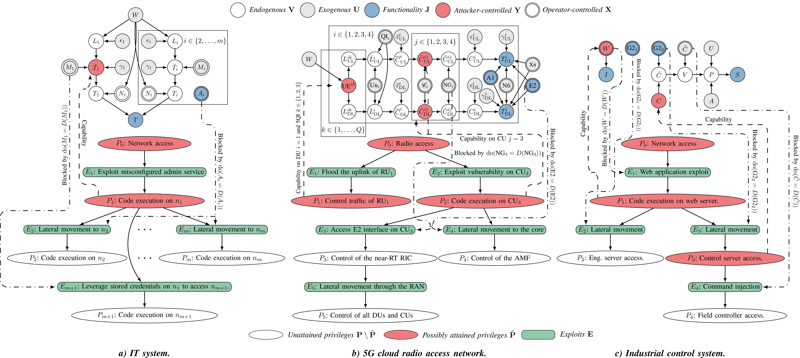
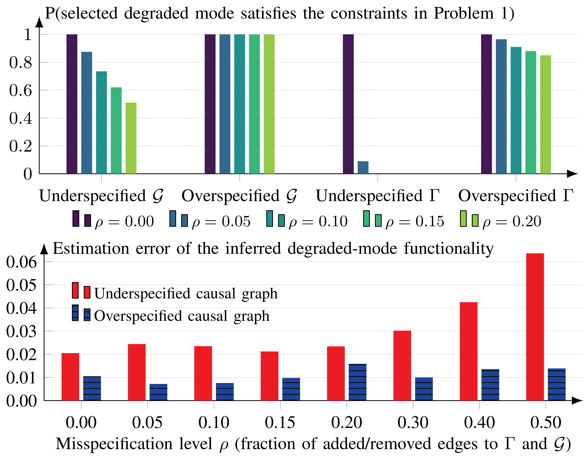
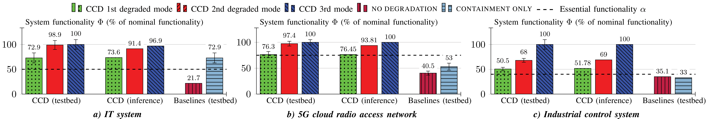
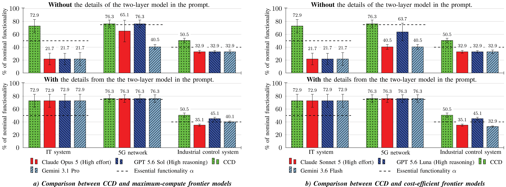

<p align="center">
    <a href="https://img.shields.io/badge/license-CC%20BY--SA%204.0-green">
        </a>
    <a href="https://img.shields.io/badge/version-0.1.0-blue">
        </a>
    <a href="https://img.shields.io/badge/python-3.10%2B-blue">
        </a>
    <a href="https://img.shields.io/badge/Maintained%3F-yes-green.svg">
        </a>
</p>

# Cyber Resilience through Controlled Degradation

Implementation of **Causal Controlled Degradation (CCD)**.



## Installation

Requires Python ≥ 3.10 and [DoWhy](https://github.com/py-why/dowhy), networkx, numpy,
pandas, scipy.

Published on PyPI as **`causal-controlled-degradation`**:

```bash
pip install causal-controlled-degradation   # then: import ccd
```

Or install from a checkout for development:

```bash
pip install -e .
```

## Usage Examples

```bash
python examples/run_scenario_1.py
python examples/scalability.py
python examples/inference_scalability.py
python examples/sensitivity.py
```



## Formal proofs (Lean 4)

The theoretical results are formalized in **Lean 4 + Mathlib**, in a separate
Lake project under [`lean/`](lean/). See [`lean/README.md`](lean/README.md) for details.

```bash
brew install elan-init        # Lean toolchain manager (once)
cd lean
lake exe cache get            # prebuilt Mathlib cache
lake build                    # build the CCD library
```

## Development

```bash
./unit_tests.sh     # run the test suite (pytest)
./linter.sh         # flake8 (max line length 120; config in .flake8)
./type_checker.sh   # mypy
```

## Release Management

```bash
pip install -e '.[release]'   # install build + twine
# edit NEW_VERSION in make_release.py, then:
python make_release.py      
```

## System Models



## Sensitivity Analysis



## Comparison with Industry Practice



## Comparison with Frontier LLMs



## Datasets

The datasets are available for download [here](https://huggingface.co/datasets/kimhammar/ccd). 

## License

Released under the **Creative Commons Attribution-ShareAlike 4.0 International**
(CC BY-SA 4.0) license; see [LICENSE.md](LICENSE.md).

© Kim Hammar, Emil C. Lupu, Tansu Alpcan, 2026
